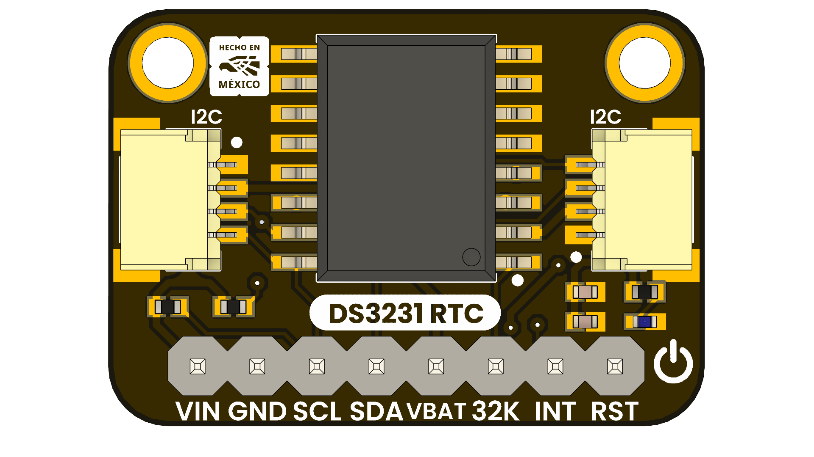

# DevLab: I2C DS3231 RTC Module

## Introduction

DS3231 is a high-precision real-time clock (RTC) module that provides accurate timekeeping for embedded systems and microcontroller projects. It features a built-in temperature-compensated crystal oscillator (TCXO) to maintain precise time even in varying environmental conditions. The module communicates via the I2C interface, making it easy to integrate into a wide range of applications.

  
  
  
  
   

  
  
<em>DS3231 RTC Module</em>

### Quick Setup

## Overview

| Feature                                         | Description                                                                                  |
|-------------------------------------------------|----------------------------------------------------------------------------------------------|
| INT Pin interrupt                              | Provides alarms and square wave output functionality                                         |
| Battery backup input                           | Ensures continuous timekeeping during power loss                                             |
| I2C interface                                  | Enables easy communication with microcontrollers and embedded systems                        |
| Temperature-compensated crystal oscillator (TCXO) | Maintains high accuracy across varying environmental conditions                              |
| Low power consumption                          | Suitable for battery-powered and energy-efficient applications                               |
| 32.768 kHz output                              | Offers external timing signal for other devices                                              |
| Multiple timekeeping formats                   | Supports both 12-hour and 24-hour timekeeping modes                                          |

## Typical Applications

| Application              | Description                                         |
|--------------------------|-----------------------------------------------------|
| Embedded Systems         | Provides accurate timekeeping for microcontroller projects. |
| Data Logging             | Timestamp data entries for logging applications.    |
| IoT Devices              | Maintain accurate time for scheduling and events.   |
| Wearable Technology      | Keep track of time in wearable devices.             |
| Consumer Electronics     | Used in devices like cameras and smart home systems. |

## Resources

- [Product Wiki](#)
- [Datasheet](#)
- [Buy Now](https://uelectronics.com/)
- [Getting Started Guide](#)

## License

This product and its documentation are licensed under the MIT License.  
See [`LICENSE.md`](LICENSE.md) for details.

  Template by UNIT Electronics

