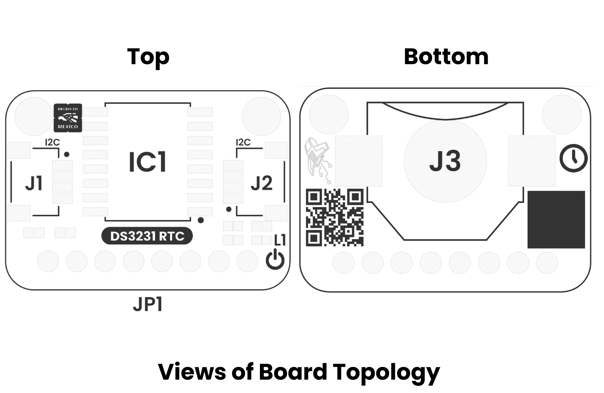
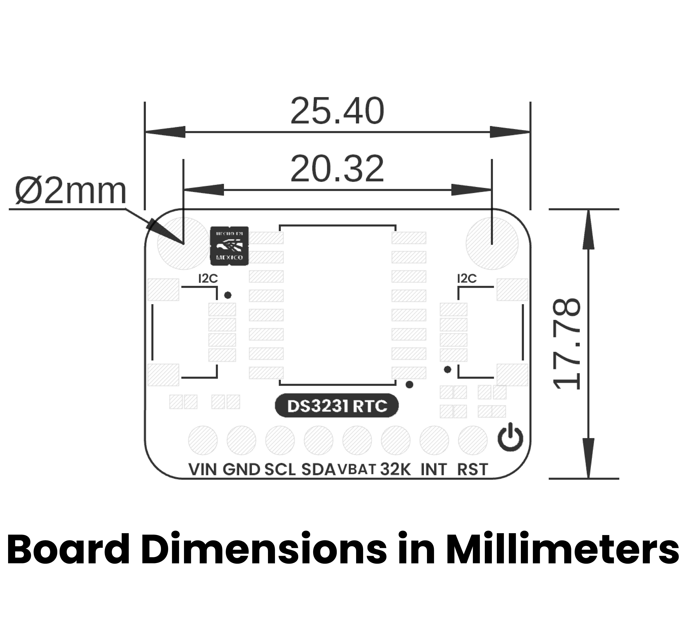

# Hardware

<a href="./unit_sch_v_1_0_0_ue0107_ds3231_rtc_module.pdf"> Schematic</a>

## Technical Specifications

### Electrical Characteristics

| **Parameter** |              **Description**               | **Min** | **Typ** | **Max** | **Unit** |
|:-------------:|:------------------------------------------:|:-------:|:-------:|:-------:|:--------:|
|      Vcc      |    Input voltage to power on the module    |   2.3   |   3.3   |   5.5   |    V     |
|     Vbat      |           Battery Supply Voltage           |   2.3   |   3.0   |   5.5   |    V     |
|      Icc      |               Supply current               |    -    |    -    |   300   |    uA    |
|      Ilo      | Output Leakage Current 32kHz, INT/SQW, SDA |   -1    |    0    |   +1    |    uA    |
|      Ili      |             Input Leakage SCL              |   -1    |    -    |   +1    |    uA    |
|      Iol      |            RST Pin I/O Leakage             |  -200   |    -    |   +10   |    uA    |
|    Ibatlkg    |     VBAT Leakage Current (VCC Active)      |    -    |   25    |   100   |    nA    |
|      Vol      |    Logic 0 Output, 32kHz, INT/SQW, SDA     |    -    |    -    |  0.4V   |    V     |
|      Vol      |            Logic 0 Output, RST             |    -    |    -    |  0.4V   |    V     |
|     fout      |              Output Frequency              |    -    | 32.768  |    -    |   kHz    |
| Ibata | Active Battery Current |- | - | 150 | uA |
| fscl | SCL Clock Frequency | 0 | - | 400 | KHz |

 

## Pinout

    <a href="unit_pinout_v_1_0_0_ue0108_ds3231_rtc_module_en.pdf"> Pinout</a>
     
     
     
    

### Pin & Connector Layout

 
| Pin   | Voltage Level | Function                                                  |
|-------|---------------|-----------------------------------------------------------|
| VCC   | 3.3 V – 5.5 V | Provides power to the on-board regulator and sensor core. |
| GND   | 0 V           | Common reference for power and signals.                   |
| SDA   | 1.8 V to VCC  | Serial data line for I²C communications.                  |
| SCL   | 1.8 V to VCC  | Serial clock line for I²C communications.                 |

> **Note:** The module also includes a Qwiic/STEMMA QT connector carrying the same four signals (VCC, GND, SDA, SCL) for effortless daisy-chaining.
> 

## Topology

<a href="./resources/unit_topology_v_1_0_0_ue0107_ds3231_rtc_module.png">  Topology</a>
 
 
 

| Ref. | Description                              |
|------|------------------------------------------|
| IC1  | DS3231 RTC                               |
| L1   | Power On LED                             | 
| JP1  | 2.54 mm Header                           |
| J1   | QWIIC Connector (JST 1 mm pitch) for I2C |
| J2   | QWIIC Connector (JST 1 mm pitch) for I2C |
| J3   | Battery Connector                        |

## Dimensions

<a href="./resources/unit_dimension_v_1_0_0_ue0107_ds3231_rtc_module.png">  Dimensions</a>

# References

- <a href="https://www.analog.com/media/en/technical-documentation/data-sheets/ds3231.pdf"> DS3231 </a>
